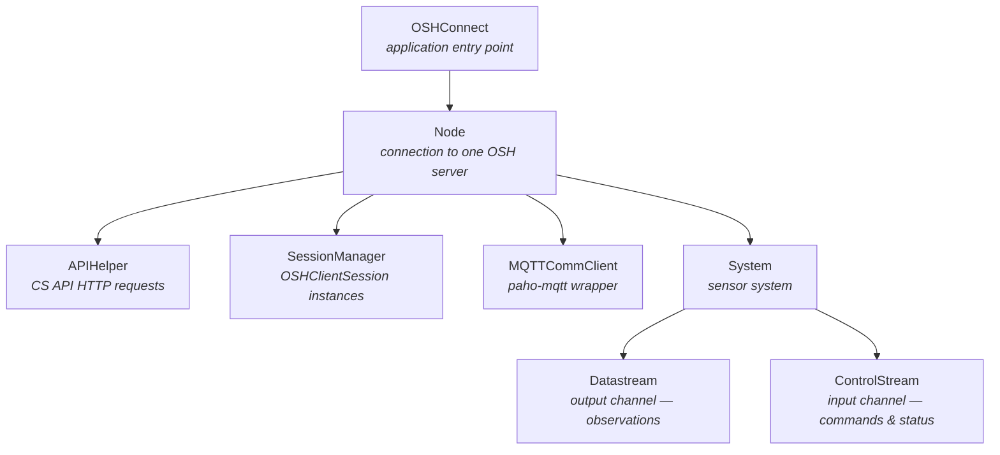
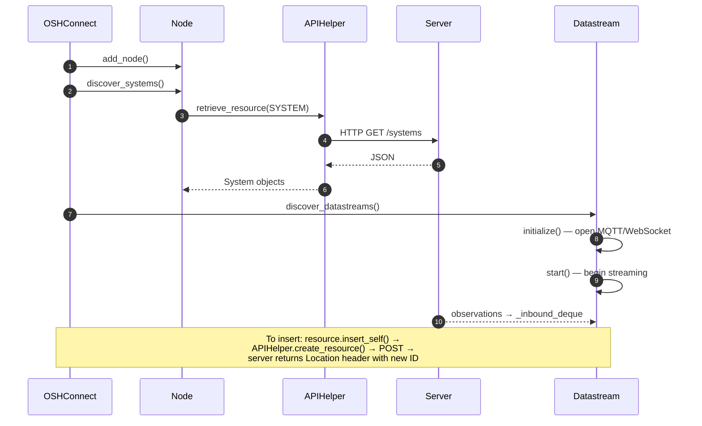

# Architecture

OSHConnect is structured around a small number of long-lived objects that mirror
the resource hierarchy of the OGC API – Connected Systems specification.

## Object hierarchy

## Key abstractions

- **`OSHConnect`** (`oshconnectapi.py`) — top-level class. Owns nodes and
  provides `discover_systems()`, `discover_datastreams()`,
  `save_config()` / `load_config()`, and `create_and_insert_system()`.
- **`Node`** (`streamableresource.py`) — wraps a server connection. Drives
  discovery via `APIHelper` and owns the `MQTTCommClient`. All HTTP resource
  creation goes through here.
- **`StreamableResource`** (`streamableresource.py`) — abstract base for
  `System`, `Datastream`, and `ControlStream`. Manages MQTT
  subscriptions/publications, WebSocket connections, and the inbound /
  outbound message deques. Connection modes: `PUSH`, `PULL`, `BIDIRECTIONAL`.
- **`Datastream` / `ControlStream`** (`streamableresource.py`) — concrete
  streamable resources. Datastreams publish observations; ControlStreams
  publish commands and receive status updates. Both follow CS API Part 3
  topic conventions (`:data`, `:status`, `:commands`).
- **`resource_datamodels.py`** — Pydantic models for the CS API resource types
  (`SystemResource`, `DatastreamResource`, `ControlStreamResource`,
  `ObservationResource`). These map directly to API request and response
  bodies.
- **`swe_components.py`** — Pydantic models for SWE Common schema components
  (`DataRecordSchema`, `QuantitySchema`, `VectorSchema`, etc.). Used to define
  observation and command schemas when creating new datastreams.
- **`csapi4py/`** — sub-package that handles the CS API specifics: URL
  construction (`endpoints.py`), request building (`con_sys_api.py`), enums
  (`constants.py`), and MQTT topic conventions (`mqtt.py`).
- **`EventHandler`** (`eventbus.py`) — singleton pub/sub bus. Listeners
  subscribe to event types (e.g. `NEW_OBSERVATION`) and topic strings; events
  are dispatched asynchronously through an internal queue.
- **`timemanagement.py`** — `TimeInstant` (epoch / ISO-8601), `TimePeriod`,
  `TemporalModes` (`REAL_TIME`, `ARCHIVE`, `BATCH`), and `TimeUtils`
  conversions.

## Typical data flow

## Dependencies

- **pydantic** — all resource and schema models. Bumping the minimum requires
  confirming pre-built wheels exist for all supported Python versions
  (3.12 – 3.14).
- **shapely** — geometry handling for spatial resources.
- **paho-mqtt** — MQTT streaming for CS API Part 3.
- **websockets** / **aiohttp** — WebSocket and async HTTP streaming.
- **requests** — synchronous HTTP for discovery and resource creation.