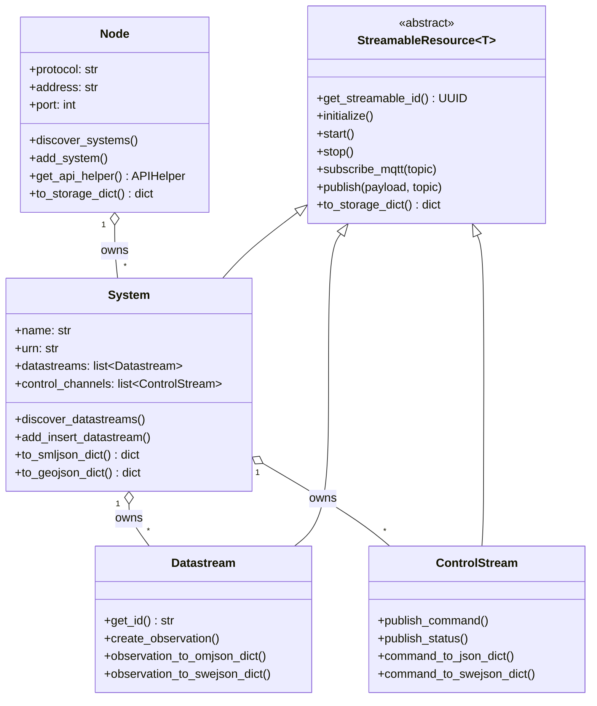
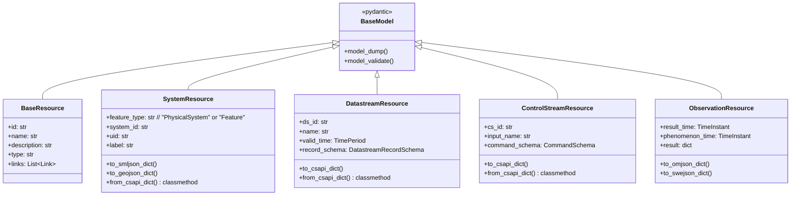
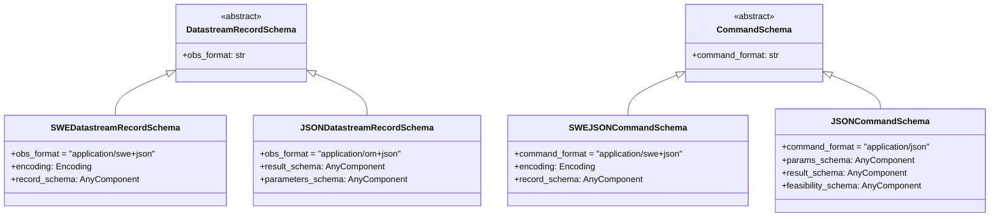
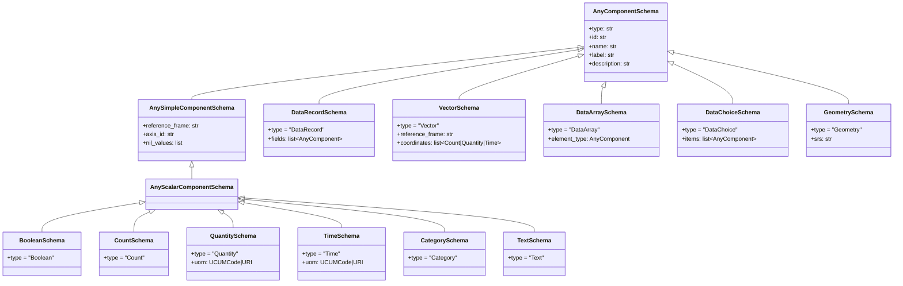

# Class hierarchy

OSHConnect's type system has three roughly-orthogonal trees: the
**user-facing wrappers** (`Node`, `System`, `Datastream`, `ControlStream`),
the **CS API resource models** that those wrappers serialize to/from on the
wire, and the **SWE Common schema components** that describe the shape of
observations and commands.

## Wrapper hierarchy

The wrapper classes are in `streamableresource.py`. `StreamableResource[T]`
is an abstract, generic base — `T` is the underlying pydantic resource
model the wrapper holds (`SystemResource`, `DatastreamResource`, or
`ControlStreamResource`). The base manages the MQTT subscribe/publish
plumbing and inbound/outbound deques common to all three concretions.

`Node` is intentionally *not* a `StreamableResource` — it's a connection
holder, not a streamable.

## CS API resource models

Pydantic models in `resource_datamodels.py`. Each is what `model_dump(by_alias=True)`
produces a CS API JSON body from, and what `model_validate(data, by_alias=True)`
parses a server response into. The wrapper classes above hold one of these
as `_underlying_resource`.

The `record_schema` / `command_schema` slots are typed
`SerializeAsAny[DatastreamRecordSchema]` /
`SerializeAsAny[CommandSchema]` so they preserve discriminated-union
polymorphism on dump — see the schema document tree below.

## Schema documents

`schema_datamodels.py` defines the polymorphic schema wrappers that live
inside `DatastreamResource.record_schema` and
`ControlStreamResource.command_schema`. The discriminator is the format
field (`obs_format` or `command_format`).

Each variant has a `to_*_dict()` / `from_*_dict()` convenience method
matching its format — see [Serialization](serialization.md).

## SWE Common component union

`swe_components.py` defines the SWE Common Data Model component types as a
discriminated union (`AnyComponent = Annotated[Union[...], Field(discriminator="type")]`).
The `type` literal on each subclass routes pydantic to the right concrete
class on parse.

(Range variants — `CountRangeSchema`, `QuantityRangeSchema`, `TimeRangeSchema`,
`CategoryRangeSchema` — extend `AnySimpleComponentSchema` directly and are
omitted from the diagram for brevity.)

## SoftNamedProperty

The `name` field is *not* a property of any data component itself per SWE
Common 3 — it lives on the `SoftNamedProperty` wrapper that binds a child
into a parent. OSHConnect enforces this via `@model_validator(mode="after")`
on the seven binding contexts: `DataRecord.fields`, `DataChoice.items`,
`Vector.coordinates`, `DataArray.elementType`, `Matrix.elementType`, and
the root recordSchema/resultSchema/parametersSchema of datastream and
control-stream wrappers.

See `tests/test_swe_components.py` for the full validation surface.
