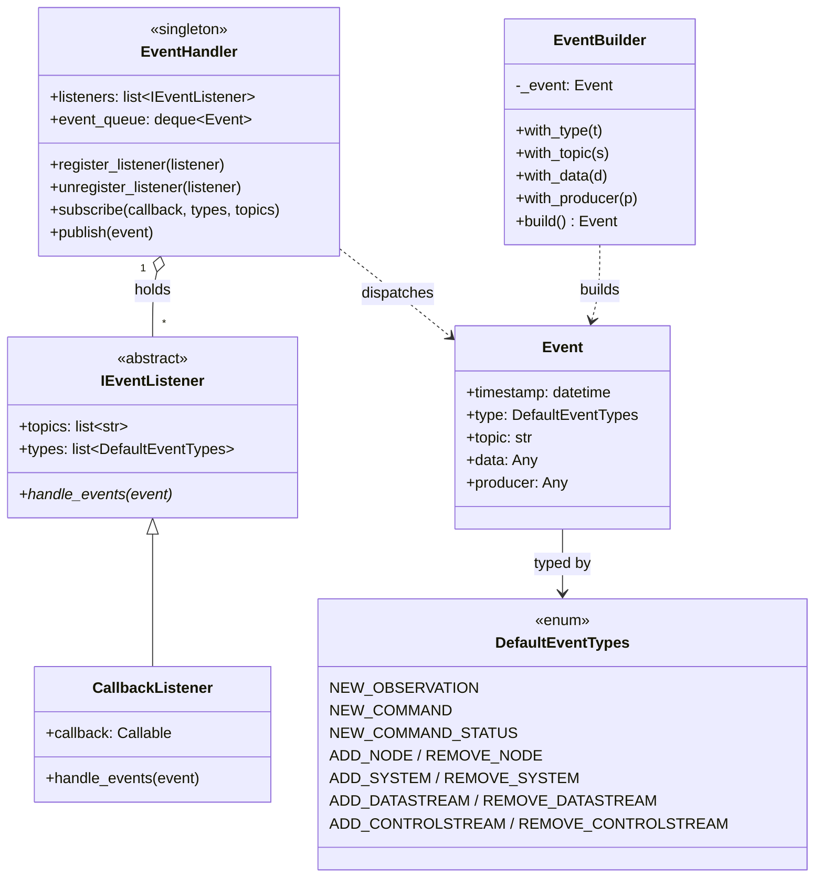
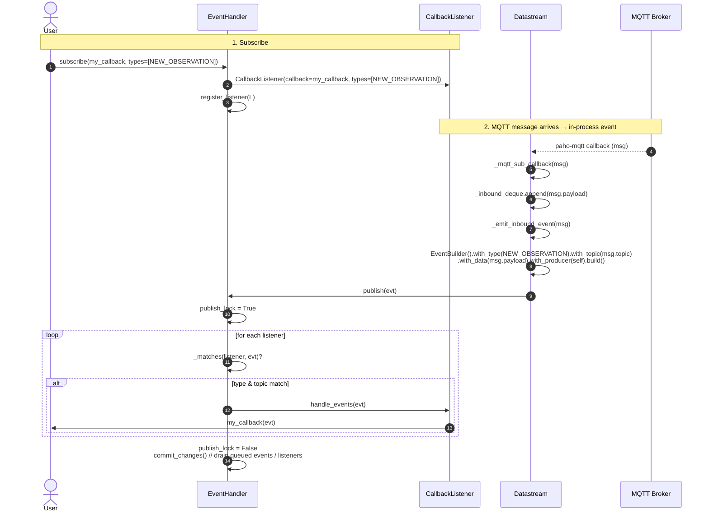

# Event system

OSHConnect has two pub/sub layers and they're easy to confuse:

- **MQTT pub/sub** — across the network. Datastreams subscribe to
  `:data` topics on the OSH server's MQTT broker; ControlStreams publish
  commands. Implemented via `paho-mqtt` in `csapi4py/mqtt.py`.
- **In-process EventHandler** — within the Python process. A singleton
  pub/sub bus that fans out `Event` objects to in-app listeners (e.g. a
  visualization widget that wants to know whenever a new observation
  arrives). Implemented in `events/`.

This page is about the second one. The two are connected: when a Datastream
receives an MQTT message, its `_emit_inbound_event(msg)` hook builds an
`Event` and publishes it to the in-process bus.

## Class diagram



`AtomicEventTypes` (CRUD verbs: CREATE, POST, GET, MODIFY, UPDATE, REMOVE,
DELETE) is a separate enum used for finer-grained sub-classification of
resource operations; it's not directly attached to `Event` but is available
for callers building their own event taxonomies.

## Subscribe → publish → dispatch

The handler is reentrancy-safe: if a listener calls `publish()` while the
handler is already inside another `publish()` (the `publish_lock` is held),
the new event is queued and drained after the current dispatch finishes.
Same for `register_listener` / `unregister_listener` mid-dispatch — they're
deferred to `to_add` / `to_remove` lists and flushed by `commit_changes()`.



## Subscribing in user code

Two styles, both call into the same `EventHandler` singleton:

**Functional (no subclassing):**

```python
from oshconnect import EventHandler, DefaultEventTypes

handler = EventHandler()

def on_observation(event):
    print(f"{event.topic}: {event.data!r}")

listener = handler.subscribe(
    on_observation,
    types=[DefaultEventTypes.NEW_OBSERVATION],
)
# later, to stop receiving:
handler.unregister_listener(listener)
```

**Subclass:**

```python
from oshconnect import EventHandler, IEventListener, DefaultEventTypes

class MyListener(IEventListener):
    def handle_events(self, event):
        ...

EventHandler().register_listener(
    MyListener(types=[DefaultEventTypes.ADD_SYSTEM])
)
```

Empty `types` or `topics` lists mean "match all" — the handler filters
before dispatching, so you don't need to filter inside your callback.

## What emits which events

| Source | Event type | Emitted from |
|---|---|---|
| Inbound observation on a Datastream's MQTT data topic | `NEW_OBSERVATION` | `Datastream._emit_inbound_event` |
| Inbound command on a ControlStream's command topic | `NEW_COMMAND` | `ControlStream._emit_inbound_event` |
| Inbound status on a ControlStream's status topic | `NEW_COMMAND_STATUS` | `ControlStream._emit_inbound_event` |
| Resource lifecycle events (`ADD_NODE`, `ADD_SYSTEM`, etc.) | matching `DefaultEventTypes` | currently emitted by the wrapper classes during construction / discovery (see `eventbus.py` re-exports for the full list) |

## See also

- `eventbus.py` re-exports `EventHandler`, `Event`, `EventBuilder`,
  `IEventListener`, `CallbackListener`, `DefaultEventTypes`, and
  `AtomicEventTypes` for convenient import from `oshconnect`.
- [Class hierarchy](class_hierarchy.md) for how the listener interface
  fits into the broader type system.
