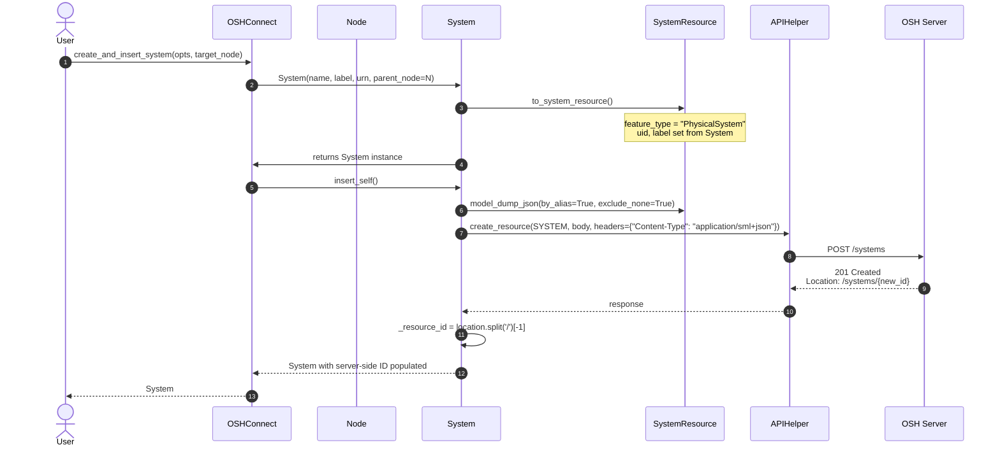
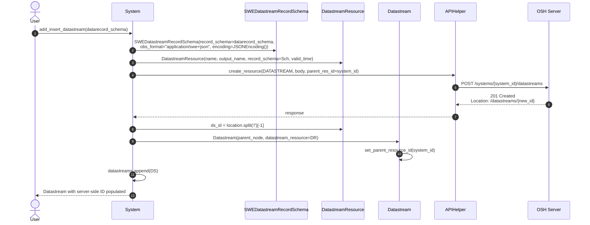

# Insertion sequence

Counterpart to the discovery flow on the [Architecture overview](index.md):
this page traces what happens when *you* push a new resource to the
server. All paths land in `APIHelper.create_resource(...)` which performs
the HTTP POST and returns the response — what differs is how the body is
constructed and where the new resource ID gets captured from the response
`Location` header.

## Inserting a System

`OSHConnect.create_and_insert_system(...)` is the typical entry point.
Internally it builds a `System` wrapper, asks it to render its
`SystemResource`, and posts the SML+JSON body.

The same pattern applies if you skip the `OSHConnect` convenience and
build a `System` directly: just call `system.insert_self()` and the wrapper
handles dump → POST → ID-capture itself.

## Inserting a Datastream

Similar shape, but the body is wrapped inside a
`SWEDatastreamRecordSchema` first (carrying the `obs_format` discriminator
and the `JSONEncoding` block), and the POST targets the parent system's
`/datastreams` subresource.

## Inserting a ControlStream

`System.add_and_insert_control_stream(...)` mirrors the datastream flow
above. Differences:

- The schema wrapper is `JSONCommandSchema` (or `SWEJSONCommandSchema`)
  instead of `SWEDatastreamRecordSchema`. The example uses the JSON form
  with `params_schema`.
- The endpoint is `/systems/{system_id}/controlstreams` instead of
  `/datastreams`.
- The wrapper class produced is `ControlStream`, with a `_status_topic`
  computed alongside the regular command topic during construction.

Otherwise the dump → POST → `Location` header → ID-capture chain is
identical.

## What `APIHelper.create_resource` does

`APIHelper.create_resource(resource_type, body, parent_res_id=None,
req_headers=None)` is the single choke point for all POST flows. It:

1. Calls `endpoints.construct_url(resource_type, parent_res_id=...)` to
   build the right URL (e.g. `/sensorhub/api/systems/{id}/datastreams`).
2. Issues `requests.post(url, data=body, headers=req_headers, auth=self.auth)`.
3. Returns the raw `requests.Response` — the caller is responsible for
   inspecting `res.ok` and parsing `res.headers['Location']`.

The wrapper classes own the `Location` parsing (you can see it on each
`insert_*` method in `streamableresource.py`). That keeps `APIHelper`
generic across all six CS API resource types.

## See also

- [Class hierarchy](class_hierarchy.md) for the wrapper / resource model relationship.
- [Serialization](serialization.md) for the `to_*_dict` methods used to
  build the POST body.
