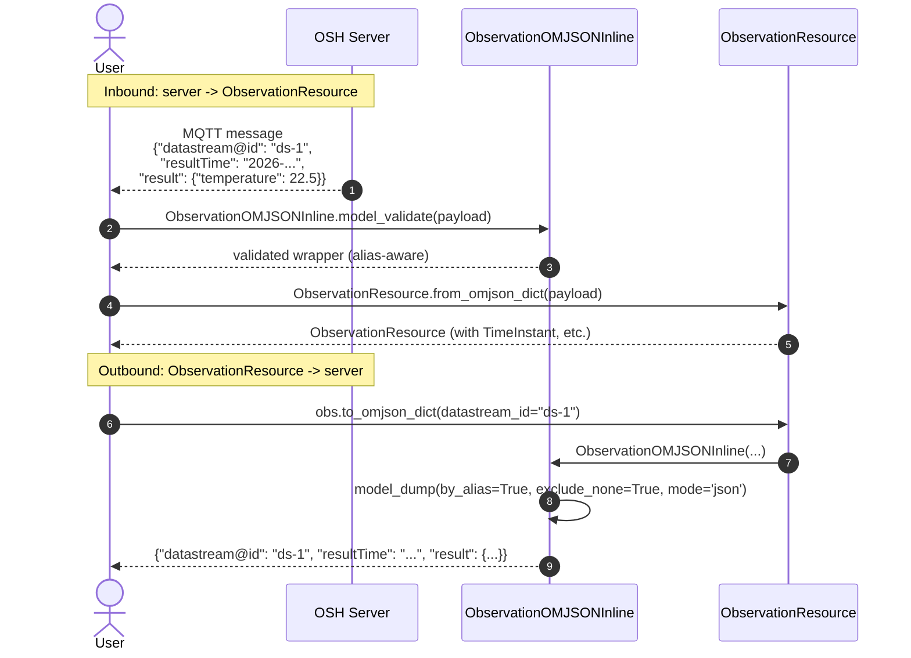

# OGC format serialization

Format-explicit conversion methods live on the **resource models** in
`resource_datamodels.py` and the **schema models** in
`schema_datamodels.py`. The wrapper classes (`System`, `Datastream`,
`ControlStream`) intentionally don't have format-conversion methods —
they bind a resource to a parent node and handle node-attached
operations (HTTP, MQTT, storage). To go between wire JSON and a
wrapper, route through the resource model.

## The three-layer matrix

```{list-table}
:header-rows: 1
:widths: 14 28 28 30

* - Resource type
  - Resource representation<br/>(the `/{type}/{id}` body)
  - Schema document<br/>(the `…/schema` body)
  - Single record<br/>(one obs / one command)
* - **System** (`SystemResource`)
  - SML+JSON: `to_smljson_dict` / `from_smljson_dict`<br/>GeoJSON: `to_geojson_dict` / `from_geojson_dict`<br/>Auto-detect parse: `from_csapi_dict`
  - n/a
  - n/a
* - **Datastream** (`DatastreamResource`)
  - `to_csapi_dict` / `from_csapi_dict`<br/>(application/json — single shape)
  - SWE+JSON: `SWEDatastreamRecordSchema.to_swejson_dict` / `from_swejson_dict`<br/>OM+JSON: `OMJSONDatastreamRecordSchema.to_omjson_dict` / `from_omjson_dict`<br/>OSH logical: `LogicalDatastreamRecordSchema.to_logical_dict` / `from_logical_dict`
  - OM+JSON: `ObservationResource.to_omjson_dict` / `from_omjson_dict`<br/>SWE+JSON: `ObservationResource.to_swejson_dict` / `from_swejson_dict`
* - **ControlStream** (`ControlStreamResource`)
  - `to_csapi_dict` / `from_csapi_dict`
  - SWE+JSON: `SWEJSONCommandSchema.to_swejson_dict` / `from_swejson_dict`<br/>JSON: `JSONCommandSchema.to_json_dict` / `from_json_dict`
  - JSON: `CommandJSON.to_csapi_dict` / `from_csapi_dict`<br/>SWE+JSON: pass `payload` through directly (flat dict)
```

Each `to_*_dict()` returns a dict (camelCase keys per CS API alias);
each has a matching JSON-string variant (`to_*_json()`) where it makes
sense, and an inverse `from_*_dict()` `@classmethod` that returns the
parsed pydantic model. Round-trips are byte-stable for fixture-style
input.

## Why this isn't on the wrapper classes

Wrappers and resources have different jobs:

- **Resource models** know about pydantic alias rules, the SWE Common
  validation rules (SoftNamedProperty, NameToken pattern), and the
  multiple wire formats each model can serialize to. Format
  conversion belongs here.
- **Wrapper classes** (`System`, `Datastream`, `ControlStream`) bind a
  resource to a parent `Node`, manage MQTT subscriptions / WebSocket
  streams, run HTTP operations (insert, fetch schema), and hand state
  to the storage layer. They don't duplicate the resource model's
  format methods.

Going from raw JSON to a wrapper is therefore explicitly two steps:

```python
from oshconnect import Datastream
from oshconnect.resource_datamodels import DatastreamResource

# 1. Resource model: parse the JSON into a typed pydantic instance.
ds_resource = DatastreamResource.from_csapi_dict(server_response_json)

# 2. Wrapper: bind that resource to a parent node.
ds = Datastream(parent_node=node, datastream_resource=ds_resource)
```

Going the other way is also one extra hop but the same pattern:

```python
ds._underlying_resource.to_csapi_dict()                           # the resource body
ds._underlying_resource.record_schema.to_swejson_dict()           # the schema doc (if SWE)
```

## Round-trip example: a single OM+JSON observation



The SWE+JSON observation path is similar but flatter: SWE+JSON encodes
a single observation as a flat JSON object whose keys are the schema's
`fields[*].name` values. `ObservationResource.to_swejson_dict()`
returns `obs.result` directly; `from_swejson_dict()` wraps a flat dict
as `result` on a fresh `ObservationResource`.

## System: SML+JSON vs GeoJSON

The same `SystemResource` model serves both shapes — only the
`feature_type` discriminator field differs:

- `feature_type = "PhysicalSystem"` → SML+JSON shape (top-level `uniqueId`,
  `label`, optional SensorML metadata fields).
- `feature_type = "Feature"` → GeoJSON shape (top-level `properties`
  dict carrying `name`/`uid`, optional `geometry`).

`SystemResource.from_csapi_dict()` inspects the incoming dict's `type`
field and dispatches to `from_smljson_dict()` or `from_geojson_dict()`
accordingly. To go from a `SystemResource` to a `System` wrapper, use
`System.from_resource(sys_res, parent_node)`.

## Logical schema (OSH-specific)

A third schema model, `LogicalDatastreamRecordSchema`, covers OSH's
`?obsFormat=logical` response shape — a JSON Schema document with OGC
extension keywords (`x-ogc-definition`, `x-ogc-refFrame`, `x-ogc-unit`,
`x-ogc-axis`) carrying SWE Common metadata. Distinct from the SWE+JSON
and OM+JSON envelopes (no `obsFormat` field, no `recordSchema`
wrapper). See [Construction → "I want the schema for an existing
datastream from the server"](construction.md) for the
`Datastream.fetch_logical_schema()` method that retrieves it.

## Deprecated factories

Two older static factories remain for backwards compatibility:

- `System.from_system_resource(sys_res, parent_node)` — emits
  `DeprecationWarning`. Use `System.from_resource(sys_res, parent_node)`.
- `Datastream.from_resource(ds_res, parent_node)` — emits
  `DeprecationWarning`. Use the constructor directly:
  `Datastream(parent_node=node, datastream_resource=ds_res)`.

Both will be removed in a future major version.

## See also

- [Class hierarchy](class_hierarchy.md) — the resource and schema model
  trees these methods live on.
- [Construction](construction.md) — how to build a wrapper once you've
  parsed a resource model from JSON, plus the schema-fetch methods.
- [Insertion sequence](insertion.md) — how the dump output flows into
  `APIHelper.create_resource()` for POSTs.
